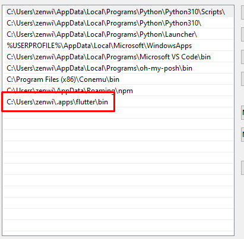
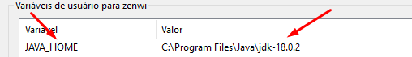

# Flutter - Instalação & Configuração (Windows)

Guia de instalação do Flutter para sistemas operacionais **Windows**.

## Instalando o SDK

Para poder iniciar projetos em Flutter será necessário primeiro baixar o SDK. **[Acesse aqui](https://docs.flutter.dev/get-started/install/windows)** para baixar o SDK.

Descompacte o arquivo **flutter_windows_3.0.5-stable.zip**.

> Recomenda-se colocar a pasta do flutter nesse caminho.
>
> `C:\src\flutter`

Após baixar o SDK, configure o flutter na **PATH**. Acesse as váriaveis de ambiente e coloque o caminho a seguir na path: `path\to\flutter\bin`.

> **Exemplo**
>
> 

após isso abra um novo terminal/cmd e digite `flutter doctor` e depois `flutter doctor --android-licenses` e aceite todas.

## Instalando JDK

Será necessário instalar o **Java Development Kit** também. Para isso acesse esse **[link](https://www.oracle.com/java/technologies/downloads/)**, selecione o sistema operacional **Windows** e clique no link do **x64 MSI Installer** para baixar o instalador, execute o instalador e o instale normalmente.

Após instalar será necessário configurar a `JAVA_HOME` na **PATH**.

Clique no botão **Novo**, no campo **Nome da variável** digite `JAVA_HOME` e no campo **Valor da variável** informe o caminho em que foi instalado o JDK. (Geralmente é instalado na de arquivos de programas)

No final ficará assim:

## Configurar VS Code

Para poder usar o VS Code como uma IDE para o **Flutter**, você terá que baixar a extensão chamada **Flutter**.

Abra o VS Code, e pressione `Ctrl` + `Shift` + `X`, no campo de pesquisa digite **Flutter** e instale a primeira extensão com autoria da **Dart Code**.

Após instalar a extensão, pressione `Ctrl` + `Shift` + `P`, e digite **Run Flutter Doctor** se tudo estiver certo, irá abrir um console na parte de baixo do **VS Code**.

## Configurar celular

> Celular utilizado: Xiaomi Redmi 9

No seu celular abra as configurações e procure a opção **Sobre o Telefone**, selecione a opção **Todas as especificações** e pressione 4 vezes a **Versão do Miui**, na parte de baixo do celular irá aparecer uma mensagem falando que você se tornou um desenvolvedor.

Após isso retorne para a tela inicial das configurações, procure a opção **Configuraçoes adicionais** selecione ela. Depois selecione a opção **Opções do desenvolvedor**.

Procure a opção **Depuração USB** ative ela, depois procure a opção **Instalar via USB** e ative ela também.

Pronto! Seu celular está pronto para iniciar os estudos em **Flutter**!

  

  By <b><a href="http://github.com/ahosall">Ahosall</a></b>!

